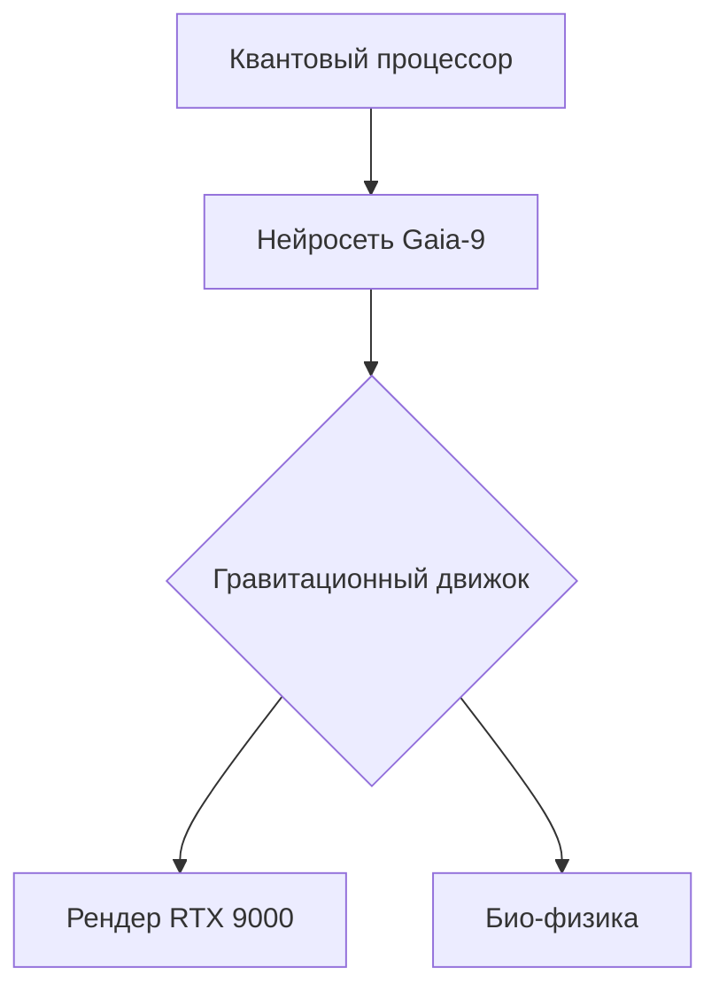

```markdown
#  SPEED SIMULATOR 3000: НОВАЯ ЭРА ДВИЖЕНИЯ 

**≡ ВЕРСИЯ 2142.12.31 | НЕЙРО-СОВМЕСТИМОСТЬ 99.9% ≡**  

<div align="center">
  
</div>

## 🌟 ОСОБЕННОСТИ МАТРИЦЫ

|  | **Квантовый движок** |
|------------------------------------------------------|----------------------|
|  | **Нейро-синхронизация** |
|  | **Биомеханический ИИ** |

```diff
+ Новое в версии 2142.12:
! Добавлен квантовый тунелинг через 7 измерение
# Оптимизированы нейро-импульсы
- Удалены устаревшие гравитационные баги
```

## 🚀 ЗАПУСК СИМУЛЯТОРА

```bash
# Для пользователей с нейро-чипами 7G:
neuro-install --matrix speed_simulator_3000 --firmware=quantum

# Для legacy-устройств (не рекомендуется):
docker run -it --rm future/speed-simulator --voltage=9000
```

## 🔮 ТЕХНОЛОГИЧЕСКИЙ СТЕК



## 📊 СИСТЕМНЫЕ ТРЕБОВАНИЯ

| Компонент | Минимум | Рекомендуется |
|-----------|---------|---------------|
| **Мозговой имплант** | NeuroLink v6 | QuantumThink X9 |
| **ОЗУ** | 128 Zettabytes | 1 Yottabyte |
| **Графика** | Встроенная нейро-матрица | NVIDIA Singularity V |
| **ОС** | Windows 2142 | Linux Quantum 9.4 |

<div align="center">
  
</div>

## 📌 ВАЖНЫЕ ПРЕИМУЩЕСТВА

```python
def future_features():
    while True:
        yield "⚡ Автономное обучение ИИ"
        yield "🌌 Генерация миров на лету"
        yield "🧠 Прямое нейро-подключение"
```

## 📡 КОНТАКТЫ ПРОЕКЦИИ

[ **Нейро-чат**](https://t.me/quantum_speed)  
[ **Крипто-поддержка**](https://etherscan.io/address/0x...)

<div align="center">
  
</div>

> ⚠️ **Внимание**: При первых 10 запусках возможны временные пространственно-временные аномалии.  
> 🔥 **Совет**: Для максимального погружения используйте квантовые VR-контактные линзы 9 поколения.  

<details>
<summary>🧪 Экспериментальные режимы (нажмите чтобы развернуть)</summary>

```lua
-- Активация гипер-скорости:
/matrix enable --protocol=lightspeed --override

-- Каллибровка нейро-интерфейса:
/sim calibrate --brainwaves=gamma --precision=0.001
```
</details>
```
